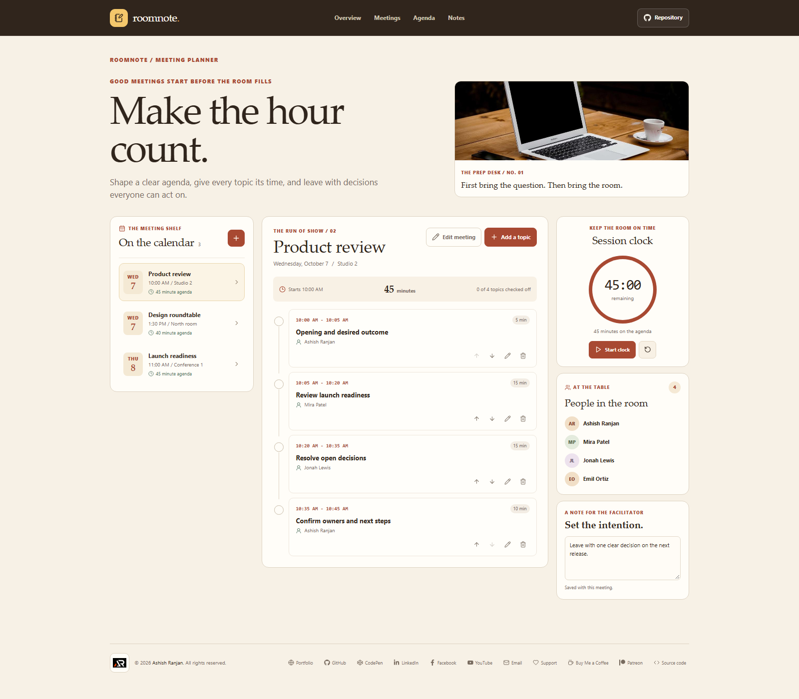

# Roomnote Meeting Agenda Builder

Roomnote is a meeting planning workspace for setting a clear purpose, building a timed agenda, and keeping the people and follow-up notes together.

## Features

- Create, edit, select, and remove meetings.
- Add agenda topics with an owner and duration, reorder them, and mark them complete.
- See each topic's scheduled time and the total meeting length update with the agenda.
- Use the session clock to keep the meeting on pace.
- Keep participant details and facilitator notes with each meeting.
- Save meetings and notes in this browser on this device.
- Use the responsive layout, fixed navigation, smooth section links, and floating back-to-top control on smaller screens.

## Run locally

```sh
npm install
npm run dev
```

## Lint and build

```sh
npm run lint
npm run build
```

## Deploy

The Vite base path and the `homepage` value in `package.json` are set for this GitHub Pages project. Run the deployment command from the project folder:

```sh
npm run deploy
```

The `predeploy` script builds the production site first. The deploy script publishes the `dist` folder to the `gh-pages` branch.

Live site: [https://a2rp.github.io/meeting-agenda-builder/](https://a2rp.github.io/meeting-agenda-builder/)

## Links

- Portfolio: [https://www.ashishranjan.net](https://www.ashishranjan.net)
- GitHub: [https://github.com/a2rp](https://github.com/a2rp)
- CodePen: [https://codepen.io/ash1198](https://codepen.io/ash1198)
- LinkedIn: [https://www.linkedin.com/in/aashishranjan](https://www.linkedin.com/in/aashishranjan)
- Facebook: [https://www.facebook.com/theash.ashish/](https://www.facebook.com/theash.ashish/)
- YouTube: [https://www.youtube.com/@ashishranjan-ashz?sub_confirmation=1](https://www.youtube.com/@ashishranjan-ashz?sub_confirmation=1)
- Email: [ash.ranjan09@gmail.com](mailto:ash.ranjan09@gmail.com)

## Support

- Support: [https://a2rp-donation-page.netlify.app/](https://a2rp-donation-page.netlify.app/)
- Buy Me a Coffee: [https://buymeacoffee.com/ashishranjan](https://buymeacoffee.com/ashishranjan)
- Patreon: [https://www.patreon.com/ashishranjan](https://www.patreon.com/ashishranjan)
